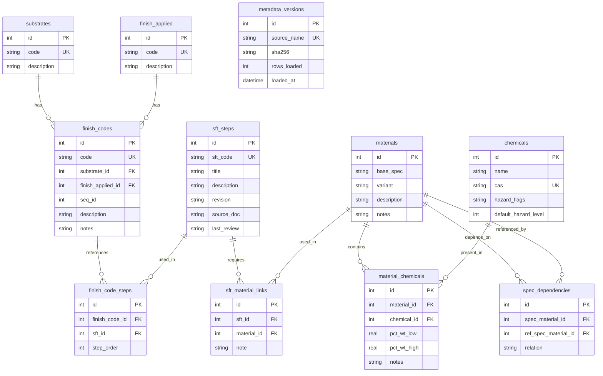

# Database Schema Overview

## Entity Relationship Diagram



## Table Descriptions

### Core Tables

#### `substrates`
Base materials that receive finishes (e.g., BRASS, STEEL, ALUMINUM).

| Column | Type | Constraints | Description |
|--------|------|-------------|-------------|
| id | INTEGER | PRIMARY KEY | Auto-increment ID |
| code | TEXT | UNIQUE, NOT NULL | Short substrate code (e.g., "B" for BRASS) |
| description | TEXT | NOT NULL | Full substrate name |

#### `finish_applied`
Types of finishes applied to substrates (e.g., PASSIVATE, ANODIZE, PLATE).

| Column | Type | Constraints | Description |
|--------|------|-------------|-------------|
| id | INTEGER | PRIMARY KEY | Auto-increment ID |
| code | TEXT | UNIQUE, NOT NULL | Short finish code (e.g., "P" for PASSIVATE) |
| description | TEXT | NOT NULL | Full finish name |

#### `finish_codes`
Composite finish codes combining substrate + finish + sequence (e.g., BP27).

| Column | Type | Constraints | Description |
|--------|------|-------------|-------------|
| id | INTEGER | PRIMARY KEY | Auto-increment ID |
| code | TEXT | UNIQUE, NOT NULL | Full finish code (e.g., "BP27") |
| substrate_id | INTEGER | FK → substrates.id | Substrate reference |
| finish_applied_id | INTEGER | FK → finish_applied.id | Finish type reference |
| seq_id | INTEGER | NOT NULL | Sequence number (e.g., 27) |
| description | TEXT | | Human-readable description |
| notes | TEXT | | Additional notes or context |

**Composite Key Logic**: `code` = `substrate.code` + `finish_applied.code` + `seq_id`

#### `sft_steps`
Standard Finish Templates - reusable process steps.

| Column | Type | Constraints | Description |
|--------|------|-------------|-------------|
| id | INTEGER | PRIMARY KEY | Auto-increment ID |
| sft_code | TEXT | UNIQUE, NOT NULL | SFT identifier (e.g., "SFT-BRASS-DEGREASE") |
| title | TEXT | NOT NULL | Short step title |
| description | TEXT | NOT NULL | Detailed process description |
| revision | TEXT | | Revision/version identifier |
| source_doc | TEXT | | Reference document (spec, SOP, etc.) |
| last_review | TEXT | | ISO date of last review |

#### `finish_code_steps`
Junction table linking finish codes to ordered SFT steps.

| Column | Type | Constraints | Description |
|--------|------|-------------|-------------|
| id | INTEGER | PRIMARY KEY | Auto-increment ID |
| finish_code_id | INTEGER | FK → finish_codes.id | Finish code reference |
| sft_id | INTEGER | FK → sft_steps.id | SFT step reference |
| step_order | INTEGER | NOT NULL | Execution order (1, 2, 3...) |

**Unique Constraint**: `(finish_code_id, sft_id)` - no duplicate steps per finish
**Unique Constraint**: `(finish_code_id, step_order)` - no gaps in sequence

### Materials and Specifications

#### `materials`
Material specifications (base spec + optional variant).

| Column | Type | Constraints | Description |
|--------|------|-------------|-------------|
| id | INTEGER | PRIMARY KEY | Auto-increment ID |
| base_spec | TEXT | NOT NULL | Base specification (e.g., "MIL-PRF-8625") |
| variant | TEXT | | Optional variant (e.g., "TYPE III, CLASS 2") |
| description | TEXT | | Material/spec description |
| notes | TEXT | | Additional context |

**Natural Key**: `(base_spec, variant)` - combination must be unique

#### `sft_material_links`
Links SFT steps to required materials.

| Column | Type | Constraints | Description |
|--------|------|-------------|-------------|
| id | INTEGER | PRIMARY KEY | Auto-increment ID |
| sft_id | INTEGER | FK → sft_steps.id | SFT step reference |
| material_id | INTEGER | FK → materials.id | Material reference |
| note | TEXT | | Usage context or application notes |

### Chemicals and Hazards

#### `chemicals`
Chemical inventory with hazard classifications.

| Column | Type | Constraints | Description |
|--------|------|-------------|-------------|
| id | INTEGER | PRIMARY KEY | Auto-increment ID |
| name | TEXT | NOT NULL | Chemical name |
| cas | TEXT | UNIQUE | CAS Registry Number (e.g., "7738-94-5") |
| hazard_flags | TEXT | | JSON string of GHS hazard codes |
| default_hazard_level | INTEGER | | Hazard severity (1=low, 5=extreme) |

**Example hazard_flags JSON**:
```json
{
  "ghs": ["H350", "H410"],
  "categories": ["CARCINOGEN", "AQUATIC_TOXIC"],
  "signal_word": "DANGER"
}
```

#### `material_chemicals`
Chemical composition of materials (weight percentage ranges).

| Column | Type | Constraints | Description |
|--------|------|-------------|-------------|
| id | INTEGER | PRIMARY KEY | Auto-increment ID |
| material_id | INTEGER | FK → materials.id | Material reference |
| chemical_id | INTEGER | FK → chemicals.id | Chemical reference |
| pct_wt_low | REAL | | Lower bound of weight % (e.g., 15.0) |
| pct_wt_high | REAL | | Upper bound of weight % (e.g., 25.0) |
| notes | TEXT | | Composition notes or conditions |

**Proprietary Data**: `pct_wt_low` and `pct_wt_high` are confidential and excluded from git.

### Auxiliary Tables

#### `spec_dependencies`
Optional table for spec-to-spec references (e.g., "MIL-PRF-8625 calls out ASTM B633").

| Column | Type | Constraints | Description |
|--------|------|-------------|-------------|
| id | INTEGER | PRIMARY KEY | Auto-increment ID |
| spec_material_id | INTEGER | FK → materials.id | Referencing spec |
| ref_spec_material_id | INTEGER | FK → materials.id | Referenced spec |
| relation | TEXT | | Relationship type (e.g., "SUPERSEDES", "REFERENCES") |

#### `metadata_versions`
Tracks CSV ingestion history for lineage and drift detection.

| Column | Type | Constraints | Description |
|--------|------|-------------|-------------|
| id | INTEGER | PRIMARY KEY | Auto-increment ID |
| source_name | TEXT | UNIQUE | CSV filename (e.g., "substrates.csv") |
| sha256 | TEXT | NOT NULL | SHA256 hash of file contents |
| rows_loaded | INTEGER | NOT NULL | Number of rows successfully loaded |
| loaded_at | DATETIME | NOT NULL | Timestamp of ingestion |

---

## CSV Input Contracts

All CSV files must be UTF-8 encoded with headers in the first row.

### `substrates.csv`
```csv
code,description
B,BRASS
S,STEEL
A,ALUMINUM
```

### `finish_applied.csv`
```csv
code,description
P,PASSIVATE
A,ANODIZE
C,CHROMATE
```

### `finish_codes.csv`
```csv
finish_code,description,substrate_code,finish_applied_code,seq_id,notes
BP27,Brass passivate with hex chromate,B,P,27,Legacy process - review for replacement
```

**Validation Rules**:
- `substrate_code` must exist in `substrates.csv`
- `finish_applied_code` must exist in `finish_applied.csv`
- `finish_code` must equal `substrate_code` + `finish_applied_code` + `seq_id`

### `sft_steps.csv`
```csv
sft_code,title,description,revision,source_doc,last_review
SFT-BRASS-DEGREASE,Alkaline Degrease,"Immerse parts in alkaline cleaner per MIL-PRF-8625 at 160-180°F for 5-10 minutes",A,MIL-PRF-8625 TYPE III,2024-01-15
```

**Validation Rules**:
- `sft_code` must be unique
- `description` required (contains process details for material extraction)

### `finish_code_steps.csv`
```csv
finish_code,sft_code,step_order
BP27,SFT-BRASS-DEGREASE,1
BP27,SFT-PASSIVATE-SEAL,2
```

**Validation Rules**:
- `finish_code` must exist in `finish_codes.csv`
- `sft_code` must exist in `sft_steps.csv`
- `step_order` must be sequential (1, 2, 3...) per finish code

### `materials_map.csv`
```csv
base_spec,variant,description,notes
MIL-PRF-8625,TYPE III CLASS 2 UNSEALED,Chromic acid anodize,Contains hexavalent chromium
ASTM B633,,Electrodeposited coatings of zinc on iron and steel,General zinc plating spec
```

**Validation Rules**:
- `(base_spec, variant)` combination must be unique
- `variant` may be empty (NULL)

### `sft_material_links.csv`
```csv
sft_code,base_spec,variant,note
SFT-BRASS-DEGREASE,MIL-PRF-8625,TYPE III CLASS 2 UNSEALED,Tank 1 solution
SFT-PASSIVATE-SEAL,ASTM B633,,Topcoat sealant
```

**Validation Rules**:
- `sft_code` must exist in `sft_steps.csv`
- `(base_spec, variant)` must exist in `materials_map.csv`

### `chemicals.csv`
```csv
name,cas,hazard_flags,default_hazard_level
Chromic Acid,7738-94-5,"{""ghs"":[""H350"",""H410""],""categories"":[""CARCINOGEN"",""AQUATIC_TOXIC""],""signal_word"":""DANGER""}",5
Sulfuric Acid,7664-93-9,"{""ghs"":[""H314""],""categories"":[""CORROSIVE""],""signal_word"":""DANGER""}",4
```

**Validation Rules**:
- `cas` must be unique (CAS Registry Number format)
- `hazard_flags` must be valid JSON
- `default_hazard_level` range: 1-5

### `material_chemicals.csv`
```csv
base_spec,variant,chemical_name,cas,pct_wt_low,pct_wt_high,notes
MIL-PRF-8625,TYPE III CLASS 2 UNSEALED,Chromic Acid,7738-94-5,15.0,25.0,Proprietary range
MIL-PRF-8625,TYPE III CLASS 2 UNSEALED,Sulfuric Acid,7664-93-9,8.0,12.0,Proprietary range
```

**Validation Rules**:
- `(base_spec, variant)` must exist in `materials_map.csv`
- `cas` must exist in `chemicals.csv`
- `pct_wt_low` ≤ `pct_wt_high`
- Sum of all chemical ranges per material should be ≤ 100% (warning, not error)

---

## Indexing Strategy

**Primary Indexes** (created by PRIMARY KEY / UNIQUE):
- All `id` columns (clustered)
- All `code` columns (unique lookups)
- `chemicals.cas` (CAS number lookups)

**Additional Indexes** (to be added in Phase 1):
```sql
CREATE INDEX idx_finish_codes_substrate ON finish_codes(substrate_id);
CREATE INDEX idx_finish_codes_finish_applied ON finish_codes(finish_applied_id);
CREATE INDEX idx_finish_code_steps_finish ON finish_code_steps(finish_code_id);
CREATE INDEX idx_finish_code_steps_sft ON finish_code_steps(sft_id);
CREATE INDEX idx_sft_material_links_sft ON sft_material_links(sft_id);
CREATE INDEX idx_material_chemicals_material ON material_chemicals(material_id);
```

---

## Data Integrity Rules

### Referential Integrity
All foreign keys enforced via SQLite `FOREIGN KEY` constraints with `ON DELETE RESTRICT`.

### Business Rules
1. **Finish Code Composition**: `finish_codes.code` must equal concatenation of substrate + finish_applied + seq_id
2. **Step Order Uniqueness**: No duplicate `step_order` values per `finish_code_id`
3. **Chemical Weight Ranges**: `pct_wt_low ≤ pct_wt_high`
4. **SFT-Material Links**: An SFT step may reference multiple materials (alternatives or multi-step)
5. **Material Uniqueness**: `(base_spec, variant)` natural key prevents duplicate material entries

### Validation Checks (in `etl/validators.py`)
- **Orphan Detection**: All FK references resolve to existing rows
- **Completeness**: No NULL values in required fields
- **Format Validation**: CAS numbers match regex pattern, JSON hazard_flags parse correctly
- **Range Validation**: Hazard levels 1-5, percentages 0-100
- **Circular Dependencies**: Detect circular spec dependencies

---

## Query Patterns

### Get Full Finish Code Tree
```sql
SELECT
    fc.code AS finish_code,
    s.code AS substrate_code, s.description AS substrate_desc,
    fa.code AS finish_applied_code, fa.description AS finish_applied_desc,
    fc.seq_id,
    sft.sft_code, sft.title AS sft_title, sft.description AS sft_desc,
    m.base_spec, m.variant,
    c.name AS chemical_name, c.cas, c.hazard_flags,
    mc.pct_wt_low, mc.pct_wt_high
FROM finish_codes fc
JOIN substrates s ON fc.substrate_id = s.id
JOIN finish_applied fa ON fc.finish_applied_id = fa.id
JOIN finish_code_steps fcs ON fc.id = fcs.finish_code_id
JOIN sft_steps sft ON fcs.sft_id = sft.id
LEFT JOIN sft_material_links sml ON sft.id = sml.sft_id
LEFT JOIN materials m ON sml.material_id = m.id
LEFT JOIN material_chemicals mc ON m.id = mc.material_id
LEFT JOIN chemicals c ON mc.chemical_id = c.id
WHERE fc.code = ?
ORDER BY fcs.step_order, m.base_spec, c.name;
```

### Get All Chemicals for a Finish Code
```sql
SELECT DISTINCT c.name, c.cas, c.hazard_flags, c.default_hazard_level
FROM finish_codes fc
JOIN finish_code_steps fcs ON fc.id = fcs.finish_code_id
JOIN sft_material_links sml ON fcs.sft_id = sml.sft_id
JOIN material_chemicals mc ON sml.material_id = mc.material_id
JOIN chemicals c ON mc.chemical_id = c.id
WHERE fc.code = ?
ORDER BY c.default_hazard_level DESC, c.name;
```

### Get Carcinogen Exposure by Finish Code
```sql
SELECT fc.code, COUNT(DISTINCT c.id) AS carcinogen_count
FROM finish_codes fc
JOIN finish_code_steps fcs ON fc.id = fcs.finish_code_id
JOIN sft_material_links sml ON fcs.sft_id = sml.sft_id
JOIN material_chemicals mc ON sml.material_id = mc.material_id
JOIN chemicals c ON mc.chemical_id = c.id
WHERE c.hazard_flags LIKE '%CARCINOGEN%'
GROUP BY fc.code
ORDER BY carcinogen_count DESC;
```

---

## Schema Versioning

- Schema DDL stored in `db/schema.sql`
- Migrations managed manually (future: Alembic)
- Schema changes require:
  1. Update `schema.sql`
  2. Document change in `docs/CHANGELOG.md`
  3. Update CSV contracts if affected
  4. Regenerate test fixtures

---

## Future Extensions

- **parts** table for part number → finish code → surface area
- **batch_exports** table for audit trails of mass chemical reports
- **user_annotations** table for manual hazard overrides with justification
- **spec_revisions** table for tracking spec document version history
